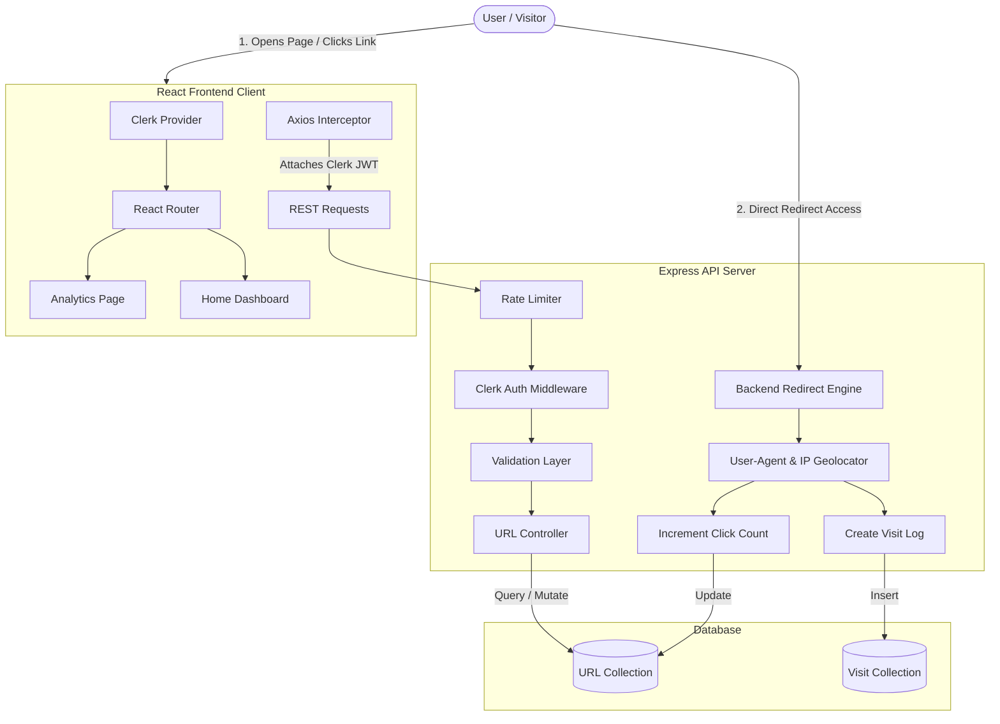

# 📘 QuickLink SaaS - Comprehensive Project Documentation

Welcome to the comprehensive technical documentation for **QuickLink SaaS**—a modern, feature-rich, high-performance URL Shortener and Real-Time Analytics platform. 

This guide is designed to explain **each and every** mechanism of the project in simple, clear, and easy-to-understand terms. Whether you are a developer extending the application or a user trying to understand how it functions, this guide has you covered.

---

## 🗺️ System Architecture

QuickLink is structured as a decoupled client-server architecture:
1. **Frontend**: A React application built with Vite, styled with Tailwind CSS, utilizing Clerk for authentication and TanStack React Query for real-time background synchronization.
2. **Backend**: A Node.js and Express REST API that handles CRUD operations, security checks, rate limiting, and visitor tracking.
3. **Database**: MongoDB (managed via Mongoose ODM) to store URL metadata and analytics logs.



---

## 🗄️ Database Design (Mongoose Schemas)

QuickLink uses two MongoDB collections to keep database queries optimized, organized, and clean.

### 1. URL Collection (`models/url.js`)
Stores all metadata for the shortened links created by users.

| Field Name | Data Type | Description | Required | Default Value |
| :--- | :--- | :--- | :---: | :--- |
| `shortId` | `String` | The unique short slug/alias for the URL (e.g., `promo2026`). | **Yes** (Unique) | *None* |
| `redirectURL` | `String` | The original long destination URL (e.g., `https://google.com`). | **Yes** | *None* |
| `createdBy` | `String` | The unique Clerk User ID who created this link. | **Yes** | *None* |
| `isFavorite` | `Boolean` | Flag to star or bookmark a URL on the dashboard. | No | `false` |
| `expiresAt` | `Date` | Timestamp after which the link is no longer valid. | No | `null` (Never expires) |
| `isArchived` | `Boolean` | Flag to hide the URL from active lists without deleting it. | No | `false` |
| `clicksCount` | `Number` | Cached counter of how many times the link has been clicked. | No | `0` |
| `visitHistory` | `Array` | Redundant array of timestamp objects for legacy support. | No | `[]` |
| `createdAt` / `updatedAt` | `Date` | Automatic Mongoose timestamps for document tracking. | Automatic | *Current Date* |

### 2. Visit Collection (`models/visit.js`)
Stores analytics logs for every single click. Each click generates a new visit document.

| Field Name | Data Type | Description | Required | Default Value |
| :--- | :--- | :--- | :---: | :--- |
| `shortId` | `String` | Links this visit log to its parent URL slug. | **Yes** (Indexed) | *None* |
| `timestamp` | `Date` | Exact time the redirect click occurred. | **Yes** (Indexed) | `Date.now` |
| `browser` | `String` | Browser name parsed from User-Agent (e.g., Chrome, Safari, Brave). | No | `"Unknown"` |
| `device` | `String` | Device type (e.g., Desktop, Mobile, Tablet). | No | `"Desktop"` |
| `os` | `String` | Operating System name (e.g., Windows, macOS, Android, iOS). | No | `"Unknown"` |
| `referrer` | `String` | Hostname of the website that referred the visitor (e.g., `t.co`). | No | `"Direct"` |
| `country` | `String` | Geolocated country name (resolved via IP). | No | `"Localhost"` |
| `city` | `String` | Geolocated city name (resolved via IP). | No | `"Localhost"` |
| `ip` | `String` | Client IP address. | No | *None* |

---

## ⚙️ Backend Mechanics (How it Works Under the Hood)

The backend server is built with Node.js and Express. It serves two distinct purposes:
1. **The API Endpoints**: Powers dashboard CRUD operations (restricted to authenticated users).
2. **The Redirection Engine**: Publicly redirects shortened URLs to their targets while logging metrics.

---

### 🛡️ Core Middlewares
The API handles traffic security and reliability using the following middleware components:
*   **Morgan**: Logs requests to the console for real-time developer debugging.
*   **Helmet**: Sets HTTP response headers to secure the app from well-known web vulnerabilities.
*   **Cors**: Allows the React frontend to communicate with the API while enabling cookie credentials.
*   **Rate Limiter (`express-rate-limit`)**: Protects URL generation/modification routes by allowing a maximum of **150 requests per 15 minutes** per IP.
*   **Clerk Middleware (`@clerk/express`)**: Intercepts JWT session tokens, decrypts them, and exposes the authenticated `userId` on the Express Request object (`req.auth.userId`).

---

### 🚦 The Redirection & Tracking Engine (`backend/index.js`)

When a user visits a link (e.g. `http://localhost:8001/url/my-alias`), the redirect handler goes through the following lifecycle:

```
[Visitor Clicks Short Link]
         │
         ▼
[Find URL in Database by shortId] 
         │
        ├──► (Not Found) ──► Return HTTP 404
         │
         ▼
[Check Expiration Date]
         │
        ├──► (Expired: Current Date > expiresAt) ──► Render Custom HTML "Expired Page"
         │
         ▼
[Parse User-Agent] (Browser, OS, Device Type)
         │
         ▼
[Brave Browser Check] (Inspect Client Hints "sec-ch-ua")
         │
         ▼
[Parse Referrer Domain] (e.g., "google.com")
         │
         ▼
[Geolocate IP] (Call ip-api.com with 1s timeout)
         │
         ▼
[Save Log in Visit Collection]
         │
         ▼
[Increment URL clicksCount +1]
         │
         ▼
[Redirect 302 to Destination URL]
```

#### Detailed Breakdown of Technical Tracking Steps:

1.  **Checking Expiration**:
    If the link has an `expiresAt` set and the date has passed, the server stops execution and responds with a premium, custom-styled dark-themed HTML page informing the user that the link has expired.
2.  **Referrer Extraction**:
    It extracts the hostname from the `referer` header:
    ```javascript
    let referrer = "Direct";
    const rawReferrer = req.headers["referer"] || req.headers["referrer"];
    if (rawReferrer) {
      try {
        const urlObj = new URL(rawReferrer);
        referrer = urlObj.hostname; // Extracts just "google.com" or "t.co"
      } catch (e) {
        referrer = rawReferrer;
      }
    }
    ```
3.  **Geo-IP Location Resolution**:
    To look up country and city, the server uses `ip-api.com`. To prevent delay or frozen threads, it has a **1-second timeout wrapper** using `AbortController`:
    ```javascript
    const controller = new AbortController();
    const timeoutId = setTimeout(() => controller.abort(), 1000); // Fail-safe timeout
    const geoUrl = isLocalIp ? "http://ip-api.com/json/" : `http://ip-api.com/json/${ip}`;
    const geoResponse = await fetch(geoUrl, { signal: controller.signal });
    ```
    If it's running locally (Localhost) or the IP matches developer network ranges (`::1`, `127.0.0.1`), it automatically maps the location to **India, Mumbai** for local testing support.
4.  **Brave Browser Detection**:
    Standard user-agents hide Brave. The server inspects User-Agent Client Hints (`sec-ch-ua` headers) to detect Brave users:
    ```javascript
    let browser = parserResult.browser.name || "Unknown";
    const secChUa = req.headers["sec-ch-ua"];
    if (secChUa && secChUa.includes("Brave")) {
      browser = "Brave";
    }
    ```

---

### 📝 REST API Controllers (`controllers/url.js`)

| HTTP Method | Route | Middleware | Controller Action | Description |
| :--- | :--- | :--- | :--- | :--- |
| **POST** | `/url/` | `requireAuth()`, `validateCreateURL` | `handleGenerateNewShortURL` | Creates a new shortened URL. Generates a random `shortId` if no custom alias is provided. Validate URL format. |
| **GET** | `/url/analytics/summary` | `requireAuth()` | `handleGetGlobalAnalytics` | Generates aggregated account-wide statistics (Daily Clicks timeline, Browser, Device, Country distribution graphs). |
| **GET** | `/url/analytics/:shortId` | `requireAuth()` | `handleGetAnalytics` | Gathers single-link analytics, browser/os counts, and the last 10 visits. |
| **PUT** | `/url/:shortId` | `requireAuth()`, `validateUpdateURL` | `handleUpdateURL` | Edits redirect target URL and extends or removes expiration limit. |
| **DELETE** | `/url/:shortId` | `requireAuth()` | `handleDeleteURL` | Deletes the URL entry and cleans up associated logs in the `Visit` collection. |
| **PATCH** | `/url/:shortId/favorite` | `requireAuth()` | `handleToggleFavorite` | Toggles favorite (starred) boolean. |
| **PATCH** | `/url/:shortId/archive` | `requireAuth()` | `handleToggleArchive` | Toggles archived status to hide it from active client list views. |

---

## 💻 Frontend Architecture (React + Vite Client)

The frontend is a single page application (SPA) designed to feel like a premium SaaS dashboard (inspired by Vercel and Plausible).

### 🔑 Authentication Integration
*   Clerk components (`SignedIn`, `SignedOut`, `RedirectToSignIn`) wrap routes to block unauthenticated requests.
*   Axios Interceptor loads JWT tokens dynamically:
    ```javascript
    API.interceptors.request.use(async (config) => {
      const token = await tokenLoader(); // Fetch JWT from Clerk
      if (token) {
        config.headers.Authorization = `Bearer ${token}`; // Append headers
      }
      return config;
    });
    ```

---

### 🔄 Real-Time State Management (TanStack React Query)
Instead of standard React `useEffect` loops, the system uses TanStack React Query.
*   **Automatic Synchronization**: All queries polling data (such as active URL tables and dashboard statistics) have `refetchInterval: 3000` enabled. The client UI updates every 3 seconds automatically without reloading.
*   **Refetch on Window Focus**: If you change tabs and return, TanStack React Query refetches automatically.
*   **Smart Mutation Invalidation**: When you create, edit, toggle favorite, or delete a URL, mutations automatically trigger query invalidations to tell the cache to re-pull fresh values immediately.

Example invalidation in `useURLMutations.js`:
```javascript
const invalidate = () => {
  queryClient.invalidateQueries({ queryKey: ["urls"] });
  queryClient.invalidateQueries({ queryKey: ["allUrls"] });
  queryClient.invalidateQueries({ queryKey: ["globalAnalytics"] });
};
```

---

### 🌗 Theme Mode (Dark/Light System)
State is managed globally in `context/ThemeContext.jsx` and toggles a CSS class `.dark` on the `document.documentElement`.
*   Themes default to **Dark Mode** (popular in developer dashboards).
*   Preferences are automatically persisted in `localStorage`.

---

### 🧱 Main Components Breakdown

1.  **`Home.jsx` (Page)**:
    Serves as the cockpit. Links filters (Favorites, Active, Expired, Archived), search inputs, sort criteria, pagination, creation forms, and side panels together.
2.  **`URLForm.jsx`**:
    Handles new links creation. Integrates a custom helper to generate dynamic expiration presets (1 Day, 7 Days, 30 Days, or Custom) and displays a success panel including downloadable/copyable QR Codes.
3.  **`DateTimePicker.jsx`**:
    A customized React-based date-time selection modal supporting inline calendars, hour/minute sliders, and clear buttons.
4.  **`URLTable.jsx`**:
    Renders user urls. Includes action overlays to star favorites, edit targets, delete, toggle archives, view QR codes, and click through to analytical charts.
5.  **`AnalyticsOverview.jsx` (Page)**:
    Shows global charts using **Recharts** (a lightweight library for rendering SVGs in React). Visualizes daily traffic graphs and browser/device/location lists in horizontal progress bars.
6.  **`Analytics.jsx` (Page)**:
    Visualizes detailed breakdowns of a single link's analytics including browser shares (Pie Chart), device types (Pie Chart), countries (Horizontal Bar Chart), Referrer Sources (Vertical Bar Chart), and a live visitor feed list displaying IP addresses and resolved cities.

---

## ⚡ Setup & Run locally

### 1. Prerequisites
Ensure you have **Node.js** (v16+) and a **MongoDB Database** (local or MongoDB Atlas connection URL) ready.

### 2. Environment Variables

Create a `.env` file in the `/backend` folder:
```env
PORT=8001
MONGO_URI=mongodb+srv://<username>:<password>@cluster0.mongodb.net/URL-SHORTNER
CLERK_PUBLISHABLE_KEY=pk_test_...
CLERK_SECRET_KEY=sk_test_...
```

Create a `.env` file in the `/frontend` folder:
```env
VITE_CLERK_PUBLISHABLE_KEY=pk_test_...
VITE_API_URL=http://localhost:8001
```

### 3. Launching
Run the server in one shell terminal:
```bash
cd backend
npm install
npm start
```
Run the client in a second shell terminal:
```bash
cd frontend
npm install
npm run dev
```

Open `http://localhost:5173` to start using your premium URL Shortener!

---

> [!TIP]
> **Pro-Tip:** If you are testing geolocation lookups locally on localhost, the engine automatically detects local IP addresses (`127.0.0.1` and `::1`) and overrides them to query default mock location metadata so the maps on your client dashboard render beautiful demo indicators immediately!
